# Como é feito o contato com os Dados do Banco (de Dados)

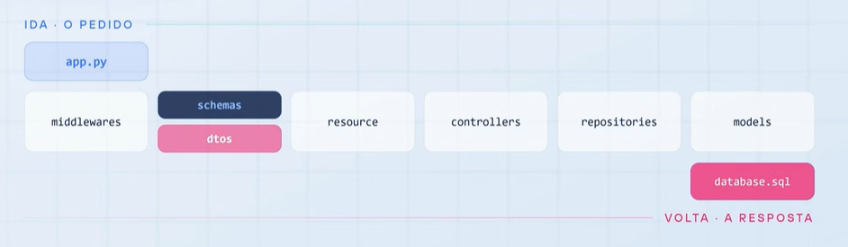

## Middlewares 
São as camadas que toda requisição atravessa para servir de validação e registro de históricos, levando em conta, especificamente nesse caso: identificador único, log de entrada e saída, verificação do token e ciclo de vida da sessão de banco. As sessões acontecem a cada interação do usuário com o banco de dados.  

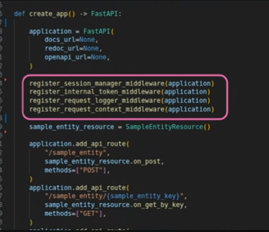

Por dentro do middleware:

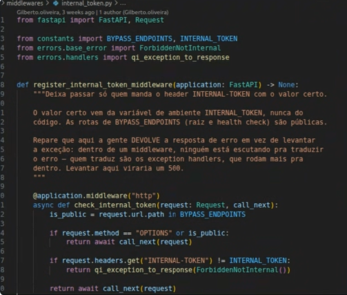

Esse código identifica se a call é pública ou precisa de um token interno e isso válida essa interação.

---

## Schema 
Cobra o formato que as informações entraram para a requisição. 

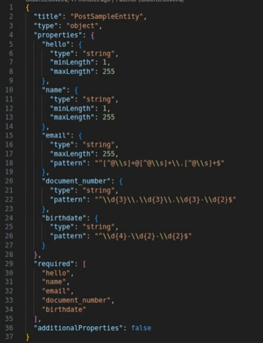

Aceita o necessário, e rejeita qualquer coisa que não esteja no padrão. (Estudar HTTP)

---

## Resource
Leva a requisição até o ambiente de excução. Valida o schema e entrega para o controlador

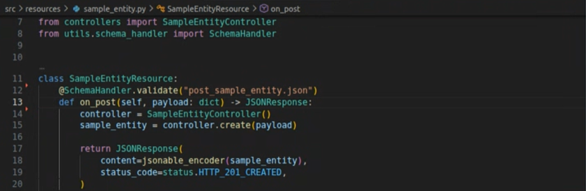

---

## Controller
Trata tudo que foi recebido junto com o banco de dados, decide o que fazer ou o que não. Faz os tratamentos necessários e dá commit. 

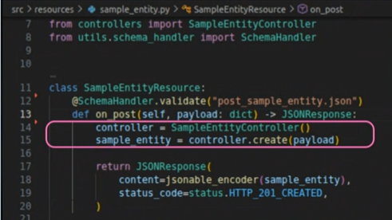
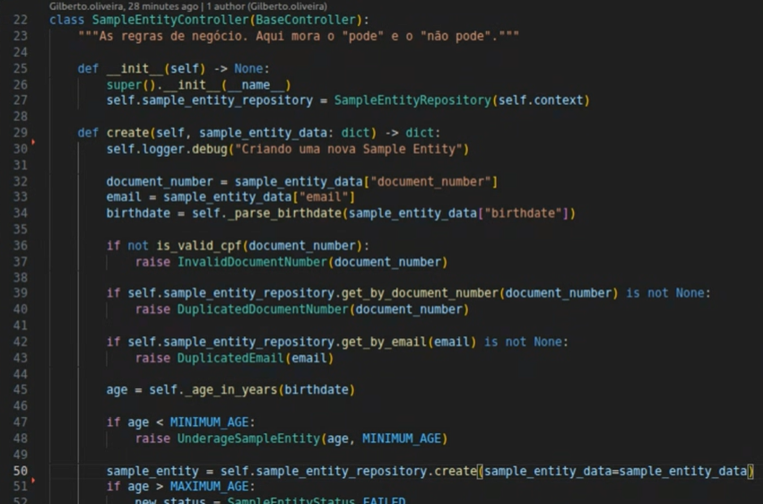

É aqui que tudo é criado, validado ou alterado. Ele valida se o que está sendo criado já existe, se as informações estão corretas, etc. Ele devolve tudo pelo DTO. O controller define, também, a ordem do fluxo, o que será fito antes ou depois, validações e isso é importante. 

---

## Repository
Essa é a única camada que se comunica com o banco. Aqui ele monta query. É o único com a chave do banco de dados. Ele recebe o contexto da requisição e tira a sessão de lá. 

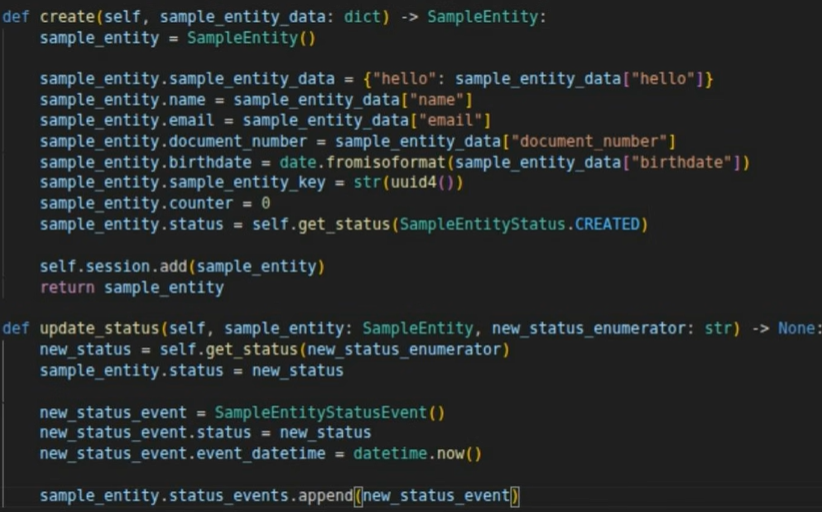

---

## Models

São as tabelas do banco de dados, usando ORM, o SQL Alchemy para Python.

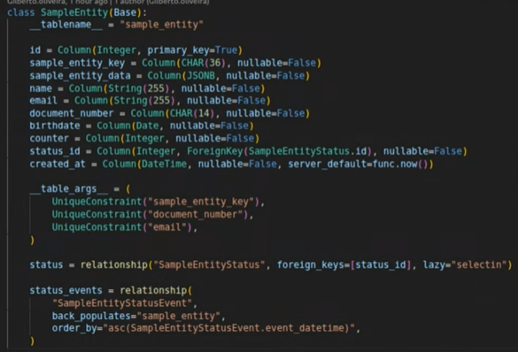
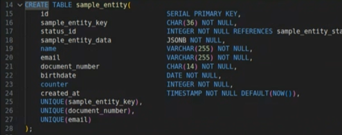

---

## DTO 
Montagem do dicionário novo para devolver a entidade criada, traduzindo o objeto do banco de dados em JSON da resposta, dado o contexto e a rota da sessão. 

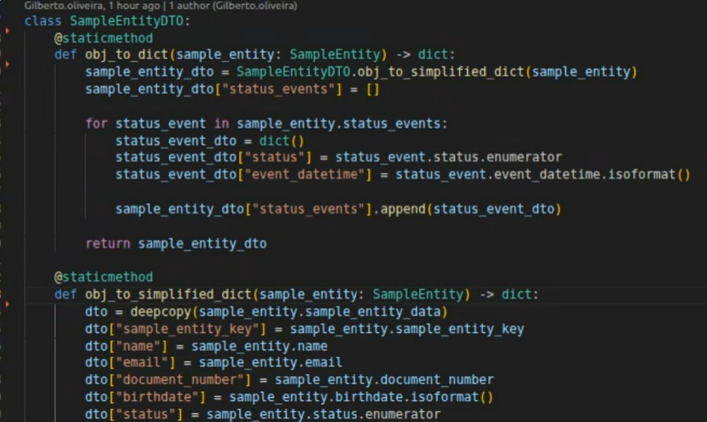